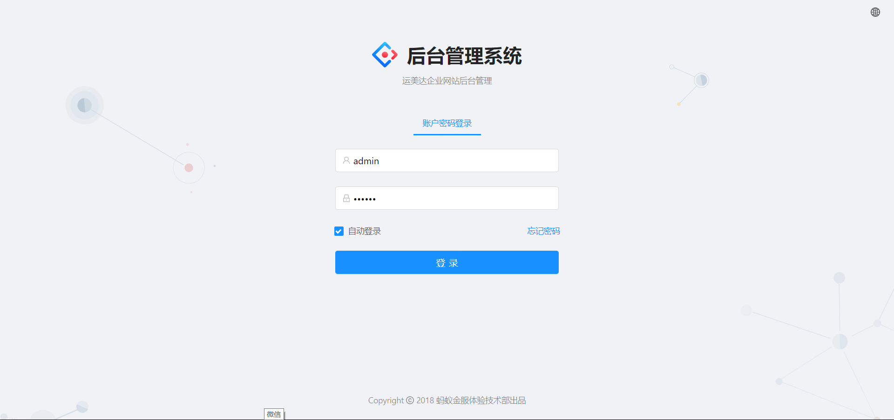
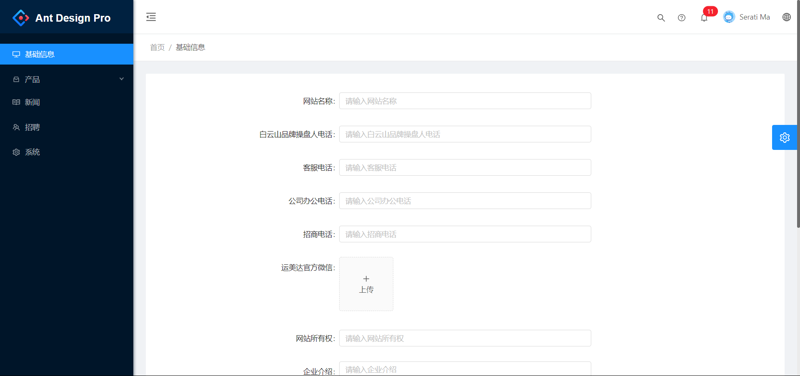
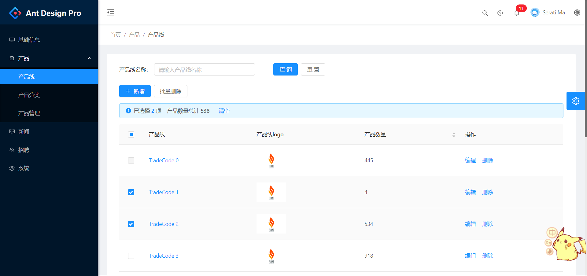
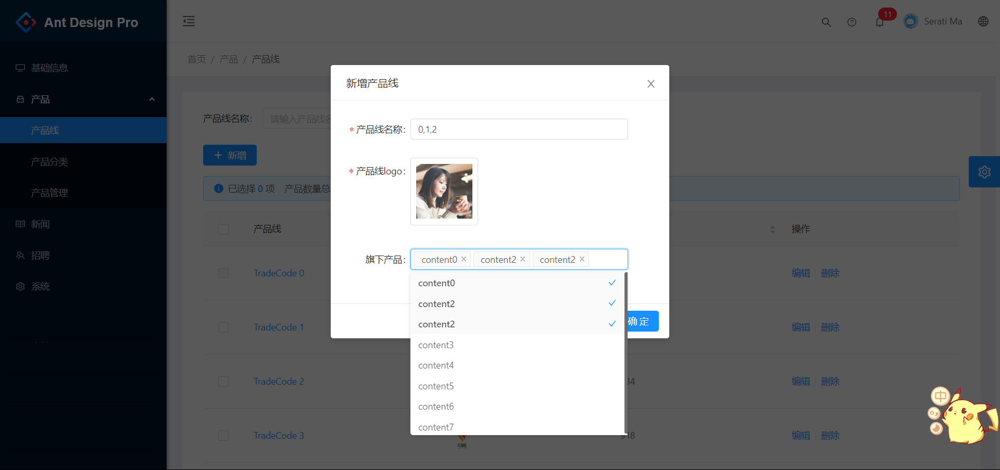
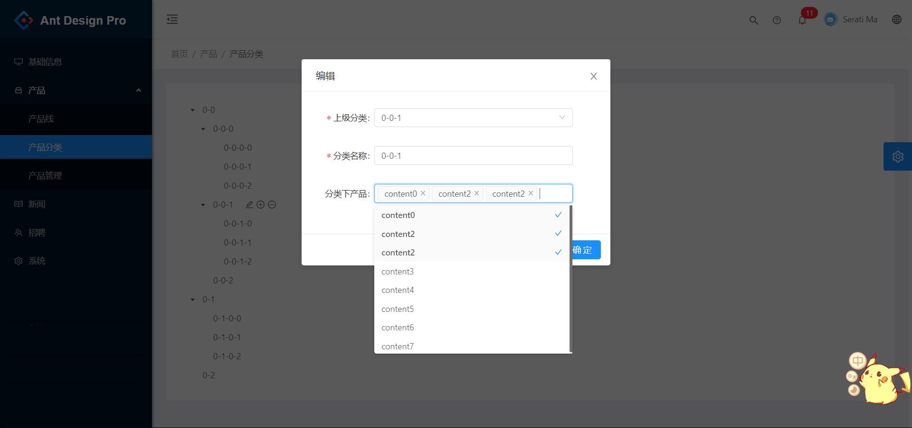
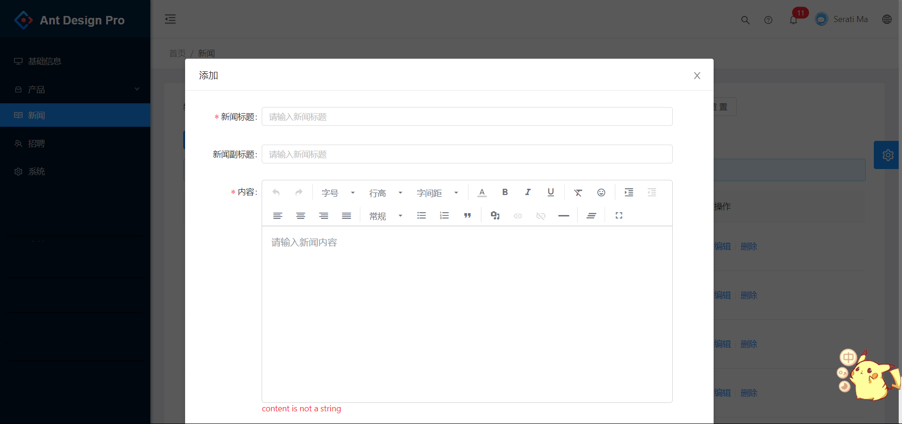
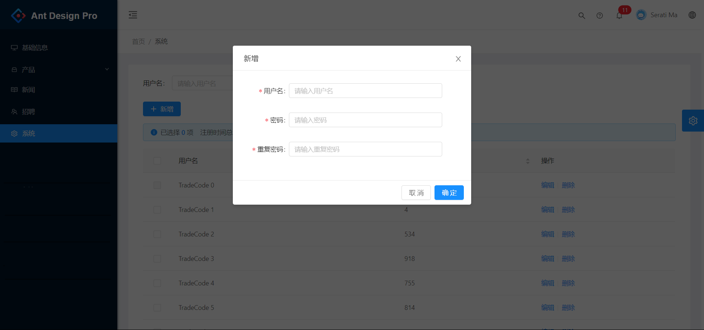

<h1 align="center">website-admin</h1>

  website-admin 是基于 Ant Design Pro 的门户后台管理web客户端。

## 功能介绍
- 系统注册、登录、注销
- 站点基础信息修改
- 产品线、产品分类管理：增删改查
- 企业新闻管理
- 招聘信息管理
- 系统用户管理

## 技术选型
技术 | 名称 | 版本
----|------|----
React | 构建用户界面的 JavaScript 库 | 16.7.0
Ant Design Pro | 开箱即用的中台前端/设计解决方案 | 2.2.1
Ant Design | 企业级UI设计语言和React UI库 | 3.13.0
Axios | 一个基于 promise 的网络请求库 | 0.18.0
Moment | JavaScript日期库 | 2.24.0
Less | CSS 预处理语言 | 3.9.0

## 浏览器支持
现代浏览器和IE11

|  IE / Edge |  Firefox |  Chrome |  Safari |  Opera |
| --------- | --------- | --------- | --------- | --------- |
| IE11, Edge| last 2 versions| last 2 versions| last 2 versions| last 2 versions

## 软件需求

- Microsoft VS Code
- node8.0+

## 本地部署

- 通过git下载源码
- yarn 安装依赖包
- yarn start 本地运行
- yarn build 构建打包
- 项目访问路径：http://localhost:8000
- 账号密码：admin/ant.design

## 预览图

> 登陆界面

> 站点基础信息修改

> 表格浏览

> 新增

> 编辑树结构

> 企业新闻管理

> 系统用户管理

